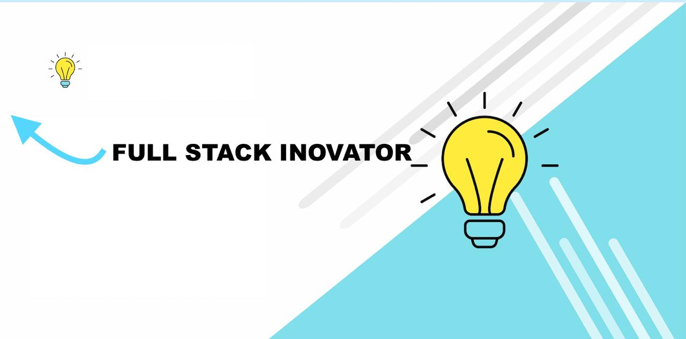

<h1 align="center">Hello! Harindu is here</h1>
<h3 align="center">19 & I innovate</h3>

 
 

# About Me:
👀 I’m interested in learning programming languages  
🌱 I’m currently studying programming languages at a university  
📫 Informatics Institute of Technology undergraduate Software Engineer  
💬 Reach me out through - harinduadhikari@gmail.com  

<h3 align="left">Connect with me:</h3>

  
  
  
  

<h3 align="left">Languages and Tools:</h3>

  
  
  
  
  
  
  
  
  
  
  
  
  
  
  

## 📈 GitHub Statistics

  
  
  

## 🦖 Holopin Badges

